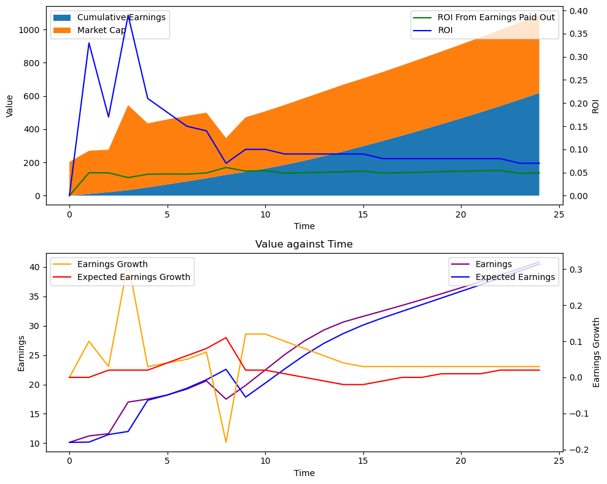

# Investment Theory

A look at models to try to predict the expectation and distribution of the rate of return on various investments over time. ROI/yield is king.

## An Example of what we found:

